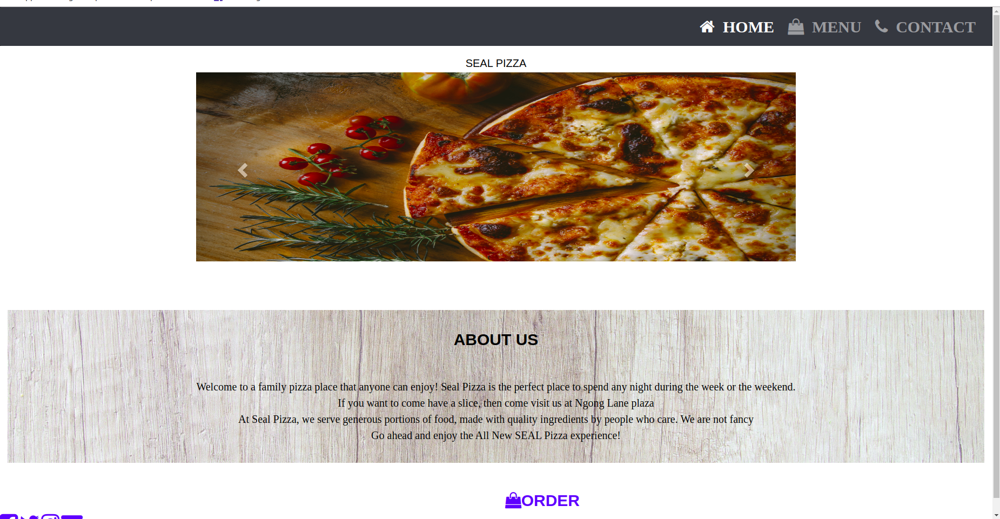
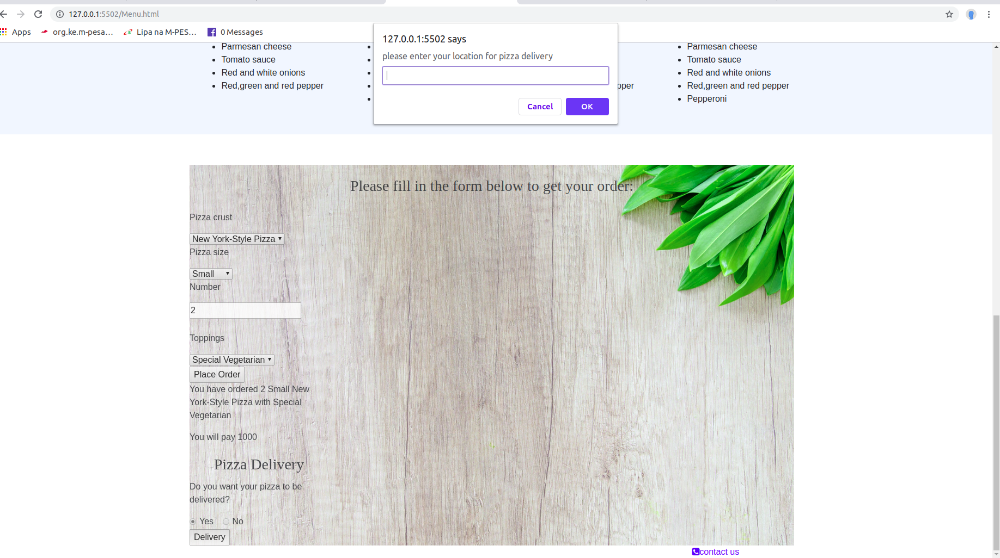
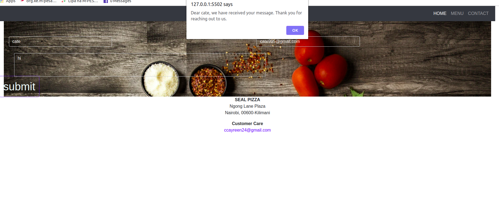

## PROJECT NAME 
- SEAL PIZZA 
## PROJECT AUTHOR
- CATHERINE NDUKU
## BDD 
* **About us**
- Get to know who we are and our location .

* **menu**
- Get to view different sizes of pizza with crust and the toppings available
-  you are able to make order as well as add order and get to know the total amount.
- if you need delivery you click yes and input your location .

* **contact**
- one can send a message or contact our customer care  or visit us 

## Setup instructions 
 - git clone or download the zip file.

 - Extract the zip file.

 - cd project folder.

 - launch the index.html file.

## Technologies used
- [HTML & CSS](https://www.w3schools.com/html/html_css.asp) - HTML is used to make the backbone of the website which mainly includes the text whereas CSS is used in styling the HTML document.
- [Bootstrap](https://getbootstrap.com/) - Bootsrap acts as a framework in building the site especially when it comes to object positioning and responsivity of the site.
- [jQuery](https://jquery.com/) - This helps in hiding and showing elements and also in clearing forms after submission.
- [java script](https://javascript.com/) - used for back end 

## Known bugs
There are no known bugs in the website so far. If you come across any, you are free to contact me via the contacts below.
## live link 
https://catherine244.github.io/SEALPIZZA/.
## Contacts information
ccayreen24@gmail.com
## license
[MIT License](https://catherine244.github.io/DelaniStudio/blob/master/LICENSE) [Catherine](https://github.com/catherine244). 

